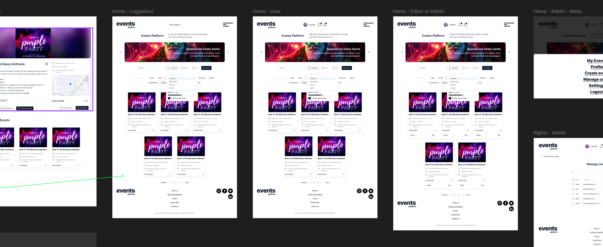
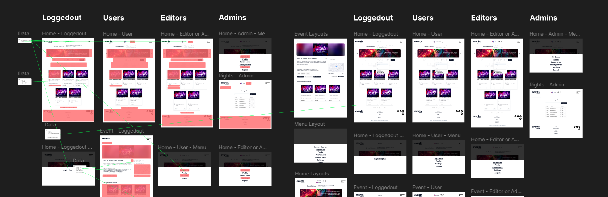
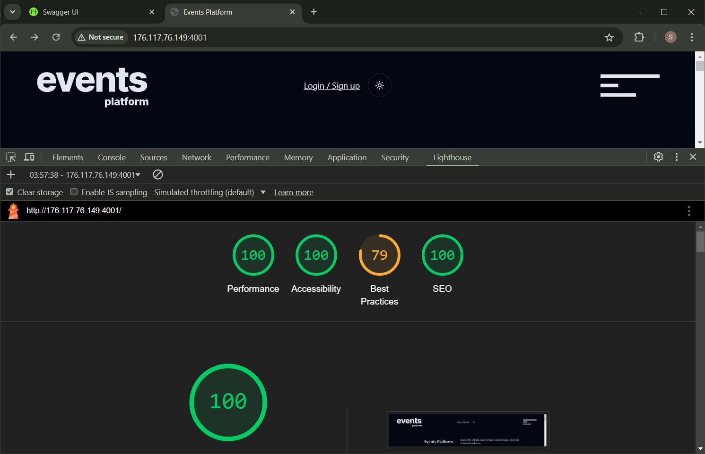
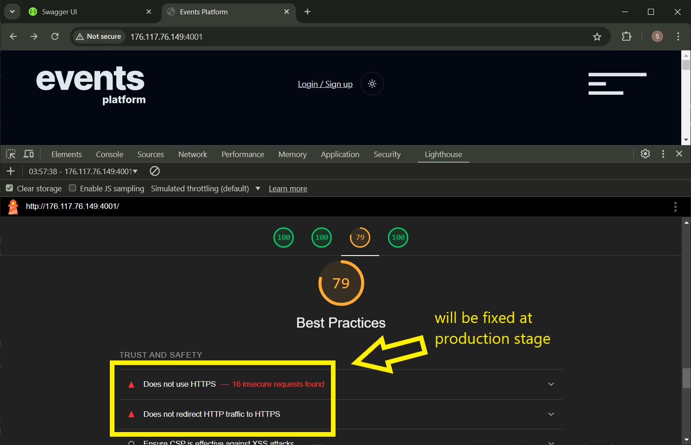

# Events Platform

This event management platform showcases modern software architecture through a practical full-stack implementation. Built entirely with TypeScript, the system uses Domain-Driven Design (DDD) architecture with clear separation of concerns and an NX monorepo structure, ensuring clear organized codebase.

## Design Implementation

I have implemented the design for this project, focusing on a user-friendly and accessible interface. The design process prioritized functionality by addressing core and essential aspects first, with additional features planned for later stages.





[Download Design File](./assets/EventsPlatform.fig)

## Reports

### Lighthouse





### Screen Reader + Keyboard navigation


## Technical Architecture

### Backend Infrastructure

- **Express.js API** with TypeScript
- **OpenAPI-First Approach**
  - Runtime request/response validation (openapi express validator)
  - Automated API documentation (Swagger)
  - Type-safe contract enforcement
- **PostgreSQL** with **Drizzle ORM**
  - Type-safe database operations
  - Automated migration management
- **Authentication & Authorization**
  - OpenID Connect integration (Auth0)
  - Role-based access control (RBAC)

### Frontend Solution

- **Next.js 14** application
  - Server-side rendering capabilities
  - Optimized performance metrics
  - Static site generation where applicable
- **shadcn/ui Components**
  - WCAG 2.1 compliance
  - Full keyboard navigation
  - Screen reader optimization
  - Comprehensive accessibility features
- **Tailwind CSS** for systematic styling
  - Custom design system
  - Responsive layouts
  - Dark mode support

### Quality Assurance

- **Testing Strategy**
  - E2E testing with Playwright setup
  - Integration tests with Jest
  - Role-based scenario coverage
  - API contract validation
  - Authentication flow verification

### DevOps & Infrastructure

- **Docker-based Development**
  - Multi-environment configurations
  - Consistent development experience
  - Production-ready deployment
- **NX Build System**
  - Optimized build caching
  - Efficient dependency management
  - Dependency graph
  - Cross-project task orchestration

## Key Differentiators

1. **Type Safety**: End-to-end TypeScript implementation ensuring robust type checking across all system boundaries
2. **API Validation**: Express OpenAPI Validator ensuring strict contract adherence and runtime validation
3. **Accessibility**: First-class accessibility support through carefully chosen UI components and implementation patterns
4. **Testing Coverage**: Comprehensive testing strategy covering all aspects from unit to end-to-end tests
5. **Scalability**: Containerized architecture ready for cloud deployment with environment-specific configurations
6. **Developer Experience**: Optimized development workflow with hot reloading, efficient builds

# Deployment

## What You Will Need

A Virtual Private Server (VPS) is a remote server hosted in a data center that gives you dedicated resources and full root access. To connect, you need:

- Server IP address
- Username (provided by VPS host)
- Password (provided by VPS host)
- SSH client on your computer

## Prerequisites Check

First, check if SSH is installed:

```bash
which ssh
```

If not installed, here's how to get it For Ubuntu / Debian:

```bash
apt-get update
apt-get install openssh-client
```

## Login to VPS

```bash
ssh username@server-ip
# Enter password when prompted
```

### Notes

- Replace `username` with your actual username
- Replace `server-ip` with actual IP addresses
- Type 'yes' if asked about fingerprint on first connection
- Password is not visible while typing
- Press Ctrl+D or type 'exit' to logout

## Set up project folder

```sh
# Open home folder
cd /home

# Create projects folder
mkdir projects

cd projects  # Remove leading slash
```

## Install Git

```bash
# Check
which git

# Install if needed
apt-get update
apt-get install git
```

## Install Docker

```sh
# Install curl if needed (which curl)
apt-get update
apt install curl

# Download install script
curl -fsSL https://get.docker.com -o get-docker.sh

# Check files in current folder
ls # outputs - get-docker.sh

sh get-docker.sh

# Remove script
rm get-docker.sh # not necessary

# Test docker
docker run hello-world

# Outputs:
    # Hello from Docker!
    # This message shows that your installation appears to be working correctly.
```

## Clone events-platform project

```bash
git clone https://github.com/serhii-fsi/events-platform.git
```

## Setup project

```bash
cd events-platform

# Rename environment file from example.env to .env
mv example.env .env

ls -a # To check files in the folder

# Edit .env file
nano .env

# Use keyboard to edit and set:
    # User random_user_name in:
        # PROD_POSTGRES_USER=random_user_name
    # your_postgres_random_password in:
        # PROD_POSTGRES_PASSWORD=your_postgres_random_password

# Create free account on auth0.com website
# and change the following values to your own:
    # AUTH0_SECRET='very_long_random_secret_very_long_random_secret'
    # AUTH0_CLIENT_ID='provided_by_auth0'
    # AUTH0_CLIENT_SECRET='provided_by_auth0'
    # AUTH0_ISSUER_BASE_URL='https://your_auth0_account_name.auth0.com'
    # AUTH0_BASE_URL='http://your_vps_ip_or_domain_name:3001'
    # AUTH0_REDIRECT_URL='http://your_vps_ip_or_domain_name:4001'

# And these values:
    # API_URL='http://your_vps_ip_or_domain_name:3001'
    # CLIENT_URL='http://your_vps_ip_or_domain_name:4001'

# your_vps_ip_or_domain_name - is the ip address or domain name of your VPS

# Ctrl + x - to exit
# y - to confirm saving
# Enter - to confirm file name
```

## Run Project

```bash
# Run Docker Compose file to install node modules
sudo docker compose -f compose.init.yml up

# Run Docker Compose file to start the project
sudo docker compose -f compose.prod.yml up

# Clean Docker containers
rm -r apps/client/.next/    # Reset .next cache
sudo docker compose -f compose.prod.yml down    # Reset containers
sudo docker compose -f compose.prod.yml down -v # Remove all data and volumes
```

# Manual Testing

## Login Process

- Open menu and click Login
- You will be redirected to the Auth0 login page
- Enter login and password (or use Google)
- You will be redirected back to the project
  - Note: As the project server uses HTTP (not HTTPS), browser (Chrome) displays an alert. (To implement HTTPS support, you need a domain name to bind with the server and request a Let's Encrypt certificate.)
    - **The information that you're about to submit is not secure.** Because this form is being submitted using a connection that's not secure, your information will be visible to others.
  - Click **Send anyway**

## Login Credentials

```
hidden
```

# Run Project for Development

## Install Dependencies

First, you need to install the project dependencies. The `node_modules` folder is located on a separate volume so every container uses the same modules.

```bash
sudo docker compose -f docker-compose.init.yml up
```

## Development Containers

Start the development containers with the "api" and "client" apps in separate shell windows:

```bash
sudo docker compose -f compose.dev.yml up
```

## Run E2E Tests

For API tests (in a separate shell window):

```bash
sudo docker compose -f compose.api-e2e.yml up
```

For client tests (in a separate shell window):

```bash
sudo docker compose -f compose.client-e2e.yml up
```
